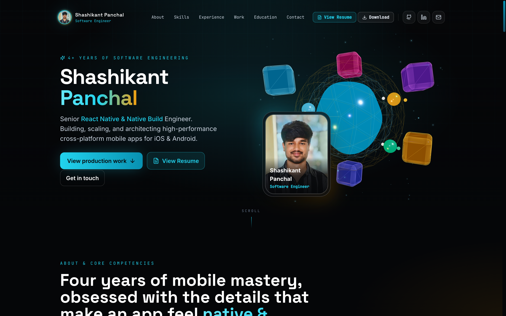
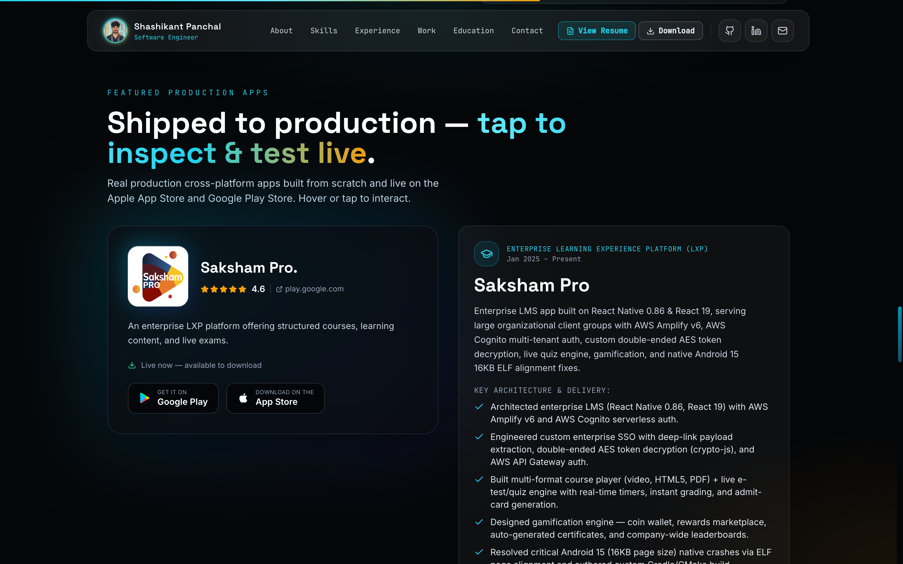
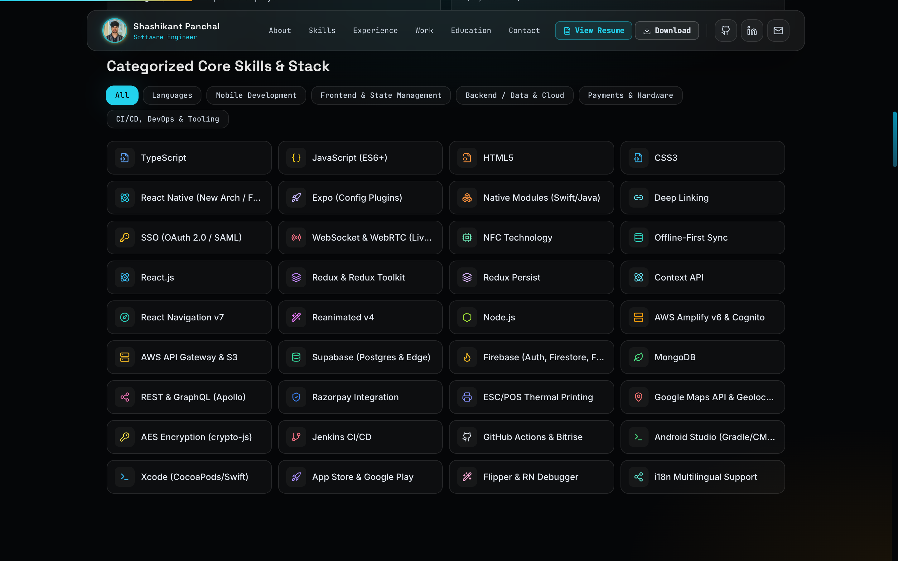
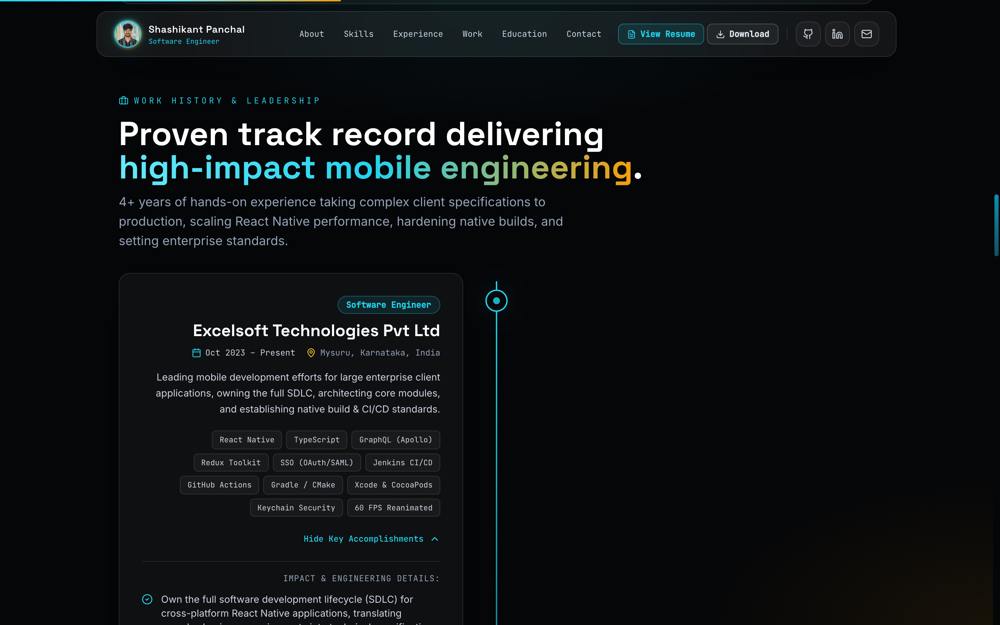
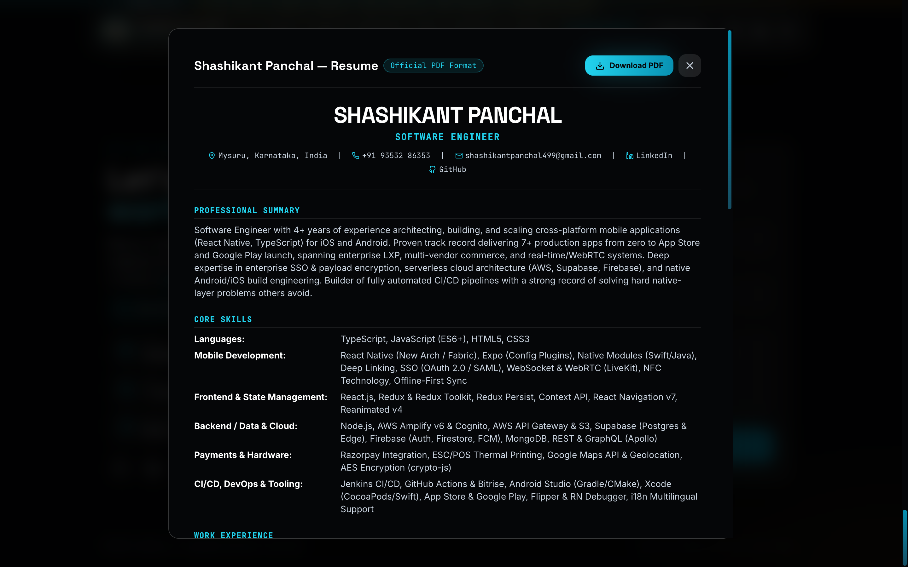
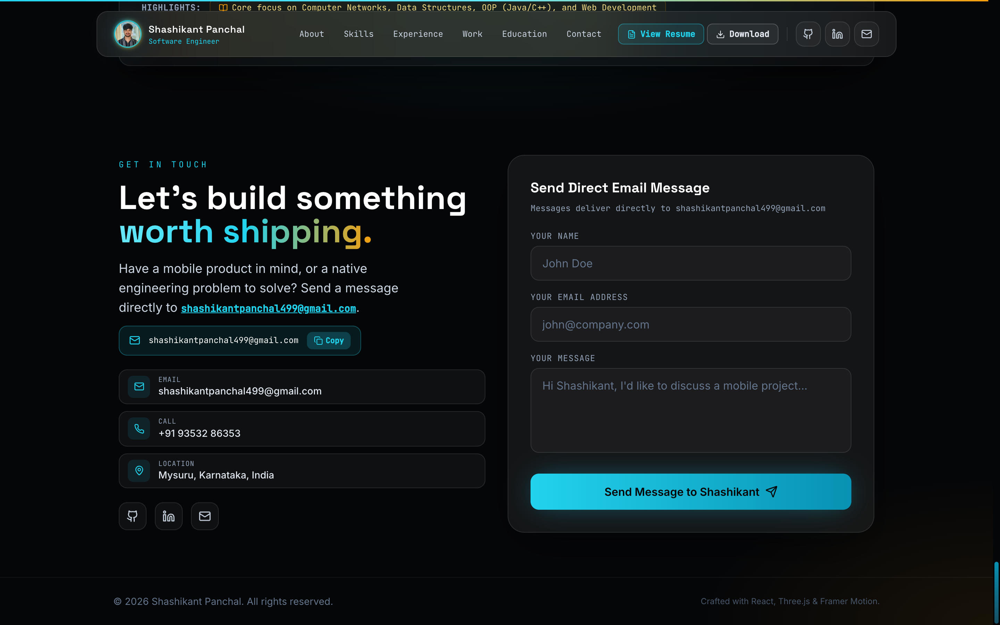
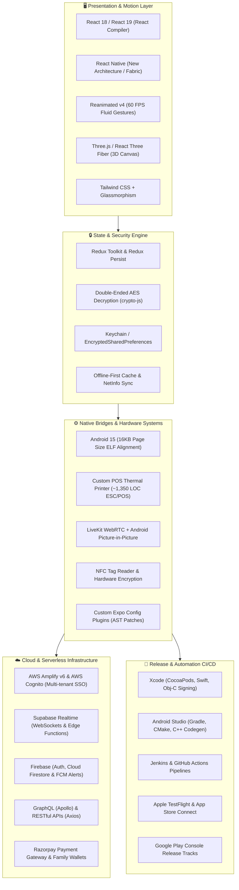

<div align="center">

# ⚡ Shashikant Panchal — Immersive 3D Portfolio

### Senior React Native & Native Platform Architect

<p align="center">
  <b>Building, scaling, and architecting high-performance cross-platform mobile apps for iOS & Android.</b>
</p>

[](https://reactnative.dev/)
[](https://react.dev/)
[](https://expo.dev/)
[](https://www.typescriptlang.org/)
[](https://threejs.org/)
[](https://tailwindcss.com/)
[](https://www.framer.com/motion/)
[](https://vitejs.dev/)

<p align="center">
  <a href="https://github.com/shashikant-panchal">
    
  </a>
  <a href="https://linkedin.com/in/shashikant-panchal-15a494271">
    
  </a>
  <a href="mailto:shashikantpanchal499@gmail.com">
    
  </a>
  <a href="tel:+919353286353">
    
  </a>
  
</p>

---

### 📊 Quick Metrics at a Glance

| 🏆 Experience | 🚀 Store Deployments | ⚡ Rendering Performance | 🛠️ Native Mastery |
| :---: | :---: | :---: | :---: |
| **4+ Years** Shipping Mobile | **7+ Apps** Live on App Store & Google Play | **60 FPS** Fluid Reanimated UIs | **100% Native** Xcode, Gradle & CMake |

</div>

---

## 📑 Table of Contents

- [✨ Overview](#-overview)
- [🖼️ Visual Showcase](#️-visual-showcase)
- [📱 Featured Production Applications](#-featured-production-applications)
- [🏗️ Architectural Blueprint](#️-architectural-blueprint)
- [🧰 Categorized Technical Arsenal](#-categorized-technical-arsenal)
- [💼 Work History & Enterprise Leadership](#-work-history--enterprise-leadership)
- [🚀 Interactive Web Features](#-interactive-web-features)
- [🛠️ Getting Started & Local Development](#️-getting-started--local-development)
- [📂 Project Architecture](#-project-architecture)
- [📫 Connect & Inquiries](#-connect--inquiries)

---

## ✨ Overview

This repository houses the source code for the **interactive portfolio website** of **Shashikant Panchal**, a Software Engineer specializing in cross-platform mobile architecture (React Native, TypeScript, Expo, iOS, Android).

Built with **React 18**, **Three.js (React Three Fiber & Drei)**, **Tailwind CSS**, and **Framer Motion**, the web experience showcases production mobile applications, deep-dive native solutions (such as **Android 15 16KB ELF alignment** and **ESC/POS thermal printer engine**), real-time WebRTC audio/video systems, and automated CI/CD release pipelines.

---

## 🖼️ Visual Showcase

### 1. Interactive 3D Hero Section
> Featuring a real-time morphing distortion mesh, orbital glowing geometry, reactive particle field, and mouse-tracked magnetic interactions.

<div align="center">
  
</div>

<br />

### 2. Shipped Production Applications Showcase
> Direct store links to live enterprise LXP, multi-vendor marketplace, and spiritual companion apps across Apple App Store and Google Play.

<div align="center">
  
</div>

<br />

### 3. Categorized Technical Arsenal & Skills Matrix
> Interactive filtering by Mobile, Languages, Frontend, Cloud/Data, Hardware, and CI/CD DevOps.

<div align="center">
  
</div>

<br />

### 4. Work History & Engineering Timeline
> Detailed breakdown of engineering leadership, native platform hardening, and architecture at Excelsoft Technologies and Mufeed.

<div align="center">
  
</div>

<br />

### 5. Interactive In-App Resume & PDF Viewer
> Built-in modal viewer with direct one-click PDF download and native browser print integration.

<div align="center">
  
</div>

<br />

### 6. Contact & Direct Messaging
> Client-side contact portal integrated with EmailJS for direct inquiries and quick-copy communication channels.

<div align="center">
  
</div>

---

## 📱 Featured Production Applications

Shashikant has architected and deployed **7+ production apps** to the **Apple App Store** and **Google Play Store**. Here are three highlighted case studies:

### 1. 🎓 Saksham Pro — Enterprise Learning Experience Platform (LXP)
*Jan 2025 – Present*

An enterprise LMS application serving large organizational client groups, built on cutting-edge **React Native 0.86** & **React 19**.

- **App Store**: [Download on iOS](https://apps.apple.com/in/app/saksham-pro/id6749613839)
- **Google Play**: [Download on Android](https://play.google.com/store/apps/details?id=com.excel.icicipru)
- **Tech Stack**: `React Native 0.86`, `React 19`, `AWS Amplify v6`, `AWS Cognito`, `Redux Toolkit`, `Redux Persist`, `Firebase FCM`, `crypto-js`, `react-native-pdf`, `Lottie`
- **Native & Architectural Innovations**:
  - **Android 15 (16KB Page Size) Alignment**: Diagnosed and resolved fatal native crashes on Android 15 caused by 16KB memory page boundary enforcement by re-aligning native ELF shared libraries.
  - **Enterprise SSO & AES Encryption**: Engineered double-ended AES token decryption (`crypto-js`) with deep-link payload extraction and AWS API Gateway authentication.
  - **Multi-Format Course & Exam Engine**: Live e-test engine with anti-cheat timers, instant grading, and admit-card generation.
  - **Gamification & Rewards**: Coin wallet, rewards marketplace, and auto-generated completion certificates.

---

### 2. 🛍️ Finecart — Multi-Vendor E-Commerce & Merchant Ecosystem
*Apr 2023 – Aug 2023*

A full-featured multi-vendor commerce app with integrated hardware receipt printing, real-time calling, and geo-scoped marketplace discovery.

- **App Store**: [Download on iOS](https://apps.apple.com/in/app/finecart/id6462674750)
- **Google Play**: [Download on Android](https://play.google.com/store/apps/details?id=com.retail.center.io)
- **Tech Stack**: `React Native`, `Redux Toolkit`, `LiveKit WebRTC`, `react-native-esc-pos-printer`, `NFC`, `Razorpay`, `Google Maps API`, `Firebase FCM`, `Axios`
- **Native & Architectural Innovations**:
  - **POS Thermal Printing Engine (~1,350 LOC)**: Authored custom ESC/POS printer driver engine supporting Bluetooth, USB, and LAN/Network thermal printers.
  - **LiveKit WebRTC with Android Picture-in-Picture (PiP)**: Real-time peer-to-peer audio/video calling between shoppers and store owners with continuous floating PiP window.
  - **Geospatial Multi-Vendor Guard**: Scoped vendor radius via Google Maps API and built cart-protection logic preventing corrupted cross-merchant orders.
  - **Hardware Integrations**: Physical NFC tag scanning for instant SKU lookups and Razorpay family wallet transactions.

---

### 3. ✨ Upāsanā — Cross-Platform Spiritual Companion App
*Dec 2025 – Feb 2026*

Next-generation cross-platform application leveraging React Native's New Architecture (Fabric) and the React Compiler for zero re-render overhead.

- **Google Play**: [Download on Android](https://play.google.com/store/apps/details?id=com.EkadashiDin.app)
- **Tech Stack**: `React Native 0.81`, `Expo 54`, `React 19`, `Supabase (Postgres & Edge Functions)`, `Reanimated v4`, `Firebase FCM`, `Razorpay`, `i18next`
- **Native & Architectural Innovations**:
  - **New Architecture (Fabric) & React Compiler**: Configured React Native 0.81 with New Architecture and React Compiler, eliminating unnecessary virtual DOM diffing for 60 FPS performance.
  - **Supabase Realtime Multiplayer Japa Rooms**: Synchronized chanting rooms over Postgres WebSockets with sub-millisecond counter updates and role-based permissions.
  - **Serverless Astronomical Engine**: Deployed Supabase Edge Functions computing dynamic Hindu Panchang & Muhurta scores in real-time based on GPS coordinates.
  - **Custom Expo Config Plugins**: Created custom Node.js AST plugins modifying `build.gradle` and `AndroidManifest.xml` during native prebuild.
  - **Zero-Downtime Dual-API Fallback**: Dual endpoint architecture with in-memory caching and offline SQLite/JSON failovers guaranteeing 99.99% scripture availability.

---

## 🏗️ Architectural Blueprint

The following diagram illustrates Shashikant's full mobile & web engineering lifecycle, from presentation and native bridges to cloud microservices and automated CI/CD pipelines:



---

## 🧰 Categorized Technical Arsenal

<div align="center">

| Domain | Technologies, Frameworks & Libraries |
| :--- | :--- |
| **Languages** | `TypeScript`, `JavaScript (ES6+)`, `HTML5`, `CSS3`, `Java`, `Swift / Obj-C Basics`, `C++ Codegen` |
| **Mobile Core** | `React Native (New Architecture / Fabric)`, `Expo (SDK 54, Config Plugins)`, `TurboModules`, `React Navigation v7` |
| **Performance & UI** | `React Compiler`, `Reanimated v4`, `Three.js`, `@react-three/fiber`, `Framer Motion`, `FastImage`, `Lottie` |
| **State & Data** | `Redux Toolkit`, `Redux Persist`, `React Context API`, `Axios`, `Apollo Client (GraphQL)`, `Offline-First Sync` |
| **Cloud & Backend** | `AWS Amplify v6`, `AWS Cognito`, `AWS API Gateway & S3`, `Supabase (Postgres, Realtime, Edge Functions)`, `Firebase (FCM, Firestore)` |
| **Hardware & Devices** | `ESC/POS Thermal Printing (Bluetooth/USB/LAN)`, `LiveKit WebRTC`, `Android Picture-in-Picture (PiP)`, `NFC Scanner` |
| **Security & Auth** | `OAuth 2.0 / SAML Enterprise SSO`, `AES Encryption (crypto-js)`, `iOS Keychain`, `Android EncryptedSharedPreferences` |
| **DevOps & Native Build** | `Android Studio (Gradle, CMake)`, `Xcode (CocoaPods)`, `Android 15 16KB Page Alignment`, `Jenkins CI/CD`, `GitHub Actions` |
| **Store Delivery** | `Apple App Store Connect`, `Google Play Console`, `TestFlight`, `Internal & Production App Tracks` |

</div>

---

## 💼 Work History & Enterprise Leadership

### 🏢 **Excelsoft Technologies Pvt Ltd** — Software Engineer
*Mysuru, Karnataka, India | Oct 2023 – Present*
- **End-to-End SDLC Leadership**: Translate complex enterprise business requirements into technical blueprints; architect and deliver high-performance iOS and Android applications.
- **Enterprise SSO & Security**: Engineered SAML and OAuth 2.0 single-sign-on flows with deep-link token extraction and hardened local encryption (Keychain, EncryptedSharedPreferences).
- **Native Build & CI/CD Pipelines**: Built automated build and release workflows with Jenkins and GitHub Actions, resolving platform-specific Gradle, CMake, and CocoaPods linking issues.
- **Android 15 Native Readiness**: Proactively resolved critical Android 15 crashes across shared libraries by implementing 16KB page boundary ELF alignments.
- **Cross-Functional Squad Leadership**: Led squads of UI/UX designers, backend engineers, and QA testers using Jira and Git, enforcing code quality standards and 60 FPS UI performance.

---

### 🏢 **Mufeed Products and Services Pvt Ltd** — React Native Developer
*Bidar, Karnataka, India | Jul 2022 – Oct 2023*
- **SaaS Platform from Scratch**: Architected, engineered, and launched a multi-tenant e-commerce mobile platform with Firebase Cloud Functions and Firestore.
- **Checkout & Real-Time Logistics**: Integrated Razorpay checkout, live inventory tracking, dynamic catalog search, and automated push notification campaigns with Firebase Cloud Messaging.
- **Reliability & Code Quality**: Collaborated within an Agile framework using Bitbucket, Jenkins, and Jira to maintain 99.8% crash-free sessions across thousands of active store users.

---

### 🎓 **Doddappa Appa College of BCA** — Bachelor of Computer Applications
*Basavakalyan, Karnataka, India | Jun 2019 – Aug 2022*
- Core focus on Data Structures, Algorithms, Computer Networks, Object-Oriented Programming (Java, C++), and Database Management Systems.

---

## 🚀 Interactive Web Features

This portfolio web application incorporates modern frontend engineering principles:

- 🎮 **Three.js Interactive Hero**: Code-split and lazy-loaded R3F canvas featuring an interactive morphing wireframe mesh and twinkling particle field that tracks cursor movement.
- 🧲 **Magnetic Elements & Custom Cursor**: Custom two-layer cursor with smooth spring physics (`useSpring`) that automatically disables on coarse-pointer/touch devices.
- 📄 **Embedded PDF Resume Viewer**: Fully responsive in-app resume modal with live PDF download and browser-native print triggers.
- ⚡ **Optimized Asset Pipeline**: Automated WebP and PNG asset compression, SVG icon hashing, and tree-shaken Lucide icons.
- ♿ **Accessibility & Reduced Motion**: Full adherence to `prefers-reduced-motion` media queries across all Framer Motion and Three.js elements.
- 📧 **Direct EmailJS Integration**: Seamless contact form dispatch without requiring external backend servers.

---

## 🛠️ Getting Started & Local Development

### Prerequisites

Ensure you have the following installed on your machine:
- **Node.js**: `v18.0.0` or higher (Recommended: `v20+` or `v22+`)
- **npm** or **pnpm** / **yarn**

### Quick Start

```bash
# 1. Clone the repository
git clone https://github.com/shashikant-panchal/Portfolio.git

# 2. Enter the directory
cd Portfolio

# 3. Install dependencies
npm install

# 4. Copy and configure environment variables
cp .env.example .env

# 5. Launch the local development server
npm run dev
```

Visit [`http://localhost:5173`](http://localhost:5173) in your browser to view the live portfolio.

### Production Build & Preview

```bash
# Type check and build production bundle
npm run build

# Preview production build locally
npm run preview
```

### Environment Variables

Copy `.env.example` to `.env` and fill in your EmailJS configuration:

```ini
# Service ID from EmailJS dashboard
VITE_EMAILJS_SERVICE_ID=service_wnks15x

# Template ID for contact form emails
VITE_EMAILJS_TEMPLATE_ID=template_xxxxxxx

# Public API key
VITE_EMAILJS_PUBLIC_KEY=your_public_key_here
```

---

## 📂 Project Architecture

```
Portfolio/
├── .github/
│   └── assets/                     # High-resolution screenshots & showcase media
├── public/
│   ├── Shashikant-P.pdf            # Official downloadable resume PDF
│   ├── myImage.jpeg                # Profile portrait
│   ├── favicon.png                 # App favicons & icons
│   └── apple-touch-icon.png
├── scripts/
│   └── capture-screenshots.mjs     # Headless Chrome script for Retina screenshot captures
├── src/
│   ├── assets/
│   │   ├── previews/               # Store application logos (Saksham, Finecart, Upasana)
│   │   └── Shashikant_Panchal_Resume.pdf
│   ├── components/
│   │   ├── three/
│   │   │   └── ThreeCanvas.tsx     # Lazy-loaded Three.js / React Three Fiber scene
│   │   ├── ui/
│   │   │   ├── Cursor.tsx          # Dual-layer magnetic custom cursor
│   │   │   ├── Magnetic.tsx        # Magnetic physics wrapper
│   │   │   ├── Reveal.tsx          # Scroll-triggered viewport animations
│   │   │   └── StorePreview.tsx    # Interactive production store card
│   │   ├── About.tsx               # Competencies & filtered skills matrix
│   │   ├── Contact.tsx             # EmailJS form & communication cards
│   │   ├── Education.tsx           # Academic background
│   │   ├── Experience.tsx          # Expandable timeline of career milestones
│   │   ├── Footer.tsx              # Copyright & credits
│   │   ├── Hero.tsx                # 3D Hero introduction & quick CTAs
│   │   ├── Navbar.tsx              # Floating frosted navigation with scroll tracking
│   │   ├── Projects.tsx            # Shipped apps showcase & technical deep-dives
│   │   └── ResumeModal.tsx         # In-browser resume viewer with print & download
│   ├── data/
│   │   └── portfolio.ts            # Single source of truth for all projects, skills & copy
│   ├── hooks/
│   │   └── useMousePosition.ts     # Smoothed pointer tracking for 3D & magnetic effects
│   ├── utils/
│   │   └── downloadResume.ts       # Cross-browser PDF file fetch & download utility
│   ├── App.tsx                     # Top-level application shell & scroll indicator
│   ├── index.css                   # Tailwind directives & design tokens
│   └── main.tsx                    # React 18 root mounting
├── index.html                      # HTML5 entry with preconnected Google Fonts
├── package.json                    # Project dependencies & build scripts
├── tailwind.config.js              # Theme colors, glow effects & typography extensions
├── tsconfig.json                   # TypeScript configuration
└── vite.config.ts                  # Vite build options & code-splitting chunks
```

---

## 📫 Connect & Inquiries

Whether you have a high-impact mobile product to build, an architectural challenge to solve, or an engineering role to discuss, feel free to reach out directly:

<div align="center">

[](https://linkedin.com/in/shashikant-panchal-15a494271)
[](https://github.com/shashikant-panchal)
[](mailto:shashikantpanchal499@gmail.com)
[](https://wa.me/919353286353)

<br />

```
📍 Location: Mysuru, Karnataka, India
📞 Mobile:   +91 93532 86353
✉️ Direct:   shashikantpanchal499@gmail.com
```

<br />

<sub>Designed and developed with ❤️ by **Shashikant Panchal**</sub>

</div>
